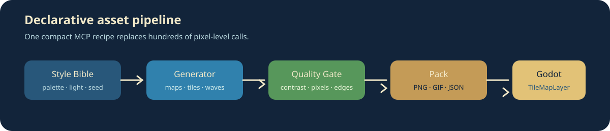

# Aseprite Asset MCP

Plan de arquitectura y evolución: [docs/IMPROVEMENT_PLAN.md](docs/IMPROVEMENT_PLAN.md). La integración con la UX independiente está documentada en [docs/ASSET_STUDIO_INTEGRATION.md](docs/ASSET_STUDIO_INTEGRATION.md).

MCP server público para crear pixel art, personajes y escenarios de Aseprite con TypeScript 6.0.3, Node.js 24 y arquitectura hexagonal.

El servidor usa stdio. El adaptador MCP llama a casos de uso de aplicación y el adaptador de infraestructura ejecuta Aseprite de forma controlada. Los workflows generan primero un plan JSON reproducible y un manifiesto compatible con Godot.

## Arquitectura

```text
src/
  domain/          contratos y resultados del dominio
  application/     casos de uso
  infrastructure/  adaptador CLI de Aseprite
  interfaces/      adaptador MCP y entrada stdio
  workflows/       planes TypeScript y cliente MCP
tests-ts/          TDD unitario y handshake MCP
```

## Estado de la migración

La rama `develop` usa únicamente el runtime TypeScript. El núcleo disponible incluye canvas, grupos, capas, frames, tags, paletas, dibujo pixelado, tilemaps, validación, exportación, planes deterministas para personajes y escenarios, y handshake MCP real por stdio.

Este proyecto mantiene su propio desarrollo, roadmap y contrato de herramientas para convertirlo en una fábrica de assets pixel-art eficiente para agentes.

## Showcase visual

Los ejemplos se generan de forma reproducible con `npm run showcase`. El mismo pipeline crea estilo, tileset, mapa, oleaje, transición temporal y manifests.




Ver también:

- [Guía de uso](docs/USAGE_GUIDE.md)
- [Recetas y reglas de calidad](docs/ASSET_RECIPES.md)
- [Ejemplos visuales](docs/media/)
- [Showcase de efectos deterministas](examples/effects/manifest.json)

## Requisitos

- Node.js 24 o posterior.
- npm 11 o posterior.
- Aseprite instalado y accesible.
- `ASEPRITE_PATH` configurado si el ejecutable no está en el PATH.

En Windows:

```powershell
$env:ASEPRITE_PATH = 'C:\Program Files (x86)\Steam\steamapps\common\Aseprite\Aseprite.exe'
npm install
npm test
```

## Conectar el MCP

`.mcp.json` usa el servidor TypeScript:

```json
{
  "mcpServers": {
    "aseprite": {
      "type": "stdio",
      "command": "npm",
      "args": ["run", "mcp", "--silent"]
    }
  }
}
```

Ejecuta manualmente con `npm run mcp`. stdout pertenece al protocolo MCP; los logs operativos van a stderr.

## Workflows para juegos

Modo plan:

```bash
npm run asset:character -- --asset=moon-knight
npm run asset:scene -- --asset=forest-ruins
```

Esto crea en `artifacts/aseprite/` el plan de llamadas y el manifiesto `*.godot.json`.

Modo ejecución, después de revisar el plan:

```powershell
$env:ASEPRITE_PATH = 'C:\Program Files (x86)\Steam\steamapps\common\Aseprite\Aseprite.exe'
npm run asset:character -- --asset=moon-knight --execute
npm run asset:scene -- --asset=forest-ruins --execute
npm run asset:odiseum-style
npm run asset:odiseum-world
npm run asset:library
npm run showcase
```

Secuencia: canvas; grupos y capas semánticas; paleta; frames y tags; validación; spritesheet, datos y manifiesto para Godot.

`asset:odiseum-style` genera los personajes, el entrenador y la transición de viaje de Odiseum. `asset:odiseum-world` genera el sheet de seis props, el glifo animado de los portales y el cristal animado exclusivo de Starfall Grove con la misma paleta cozy. `asset:library` genera `odiseum-cozy-kit`, una biblioteca reutilizable de ocho assets de entorno de 48 px con sombras de contacto, navegación, naturaleza y arquitectura.

La biblioteca se exporta en `art/library/odiseum-cozy-kit.png` junto con `asset-library.json`. El manifiesto documenta el índice de cada frame, categoría, paleta, escala y regla de renderizado nearest para reutilizar el kit en otros juegos originales.

## Herramientas compactas para agentes

El agente puede descubrir capacidades por carpetas antes de cargar detalles:

- `get_tools_list`: devuelve carpetas y conteos sin repetir los más de cien nombres.
- `get_tools_by_folder`: carga solo una familia, por ejemplo `asset/animation` o `asset/quality`.
- `run_asset_recipe`: ejecuta o previsualiza recetas `pixel_art`, `animation_pixel_art`, `gif` y `atlas`.
- `batch_asset_job`: agrupa varias recetas en una sola llamada y devuelve un resultado compacto.
- `convert_image_to_pixel_art`: convierte PNG, JPG, WebP y otros formatos soportados por Sharp con resize box/nearest, paleta limitada, transparencia y dithering Bayer opcional.
- `convert_animation_to_pixel_art`: procesa todos los frames con una paleta global y conserva sus delays en GIF.
- `upscale_pixel_art`: aumenta sprites estáticos o animados con nearest-neighbor determinista, conserva transparencia/delays y limita la salida a 4096 px.
- `harmonize_asset_palette`: mueve un PNG/GIF hacia una familia cromática de acento, limita la paleta y conserva transparencia/delays en una salida separada.
- `build_contact_sheet`: ajusta sprites heterogéneos a celdas nearest-neighbor, genera un PNG de preview y un manifest JSON navegable en una sola llamada.
- `export_animation_gif`: exporta una imagen animada o un `.aseprite` a GIF.
- `inspect_asset` y `validate_asset_quality`: reportan dimensiones, frames, colores, transparencia, delays y pixeles aislados antes de exportar.
- `inspect_asset_bundle`: combina inspección, quality gate, violaciones y recomendaciones deterministas en una sola respuesta compacta.
- `inspect_asset_batch`: audita hasta 32 assets en una sola llamada, conserva el orden, aísla fallos de decodificación y devuelve un resumen `valid/invalid/failed` sin transferir buffers de píxeles.
- `audit_asset_manifest`: revisa los archivos referenciados por un manifest generado, detecta faltantes o archivos vacíos y devuelve formato, tamaño y hash SHA-256 en una respuesta compacta.
- `recommend_asset_scene`: recibe un prompt de mundo, tags o efectos y devuelve una selección determinista de assets con ranking, razones y cobertura de tipos/variantes para componer escenas con menos llamadas.
- `build_scene_bundle`: compone en una llamada la versión PNG, la animación GIF y sus manifests de una escena, reutilizando los compositores existentes y deteniéndose si falla la composición estática.
- `apply_enhancement_bundle`: inspecciona, planifica, aplica y ejecuta quality gate en una sola llamada determinista, preservando la fuente y reduciendo round-trips de la UX/agente.
- `apply_enhancement_batch`: aplica ese bundle a hasta 24 assets en una llamada, conserva el orden, aísla fallos por archivo y bloquea colisiones antes de escribir.
- `inspect_animation_quality`: audita una animación en una sola llamada, detecta frames duplicados, cambios por transición, timing irregular, deriva de paleta y costura de loop.
- `inspect_sprite_geometry`: calcula bounds alfa, componentes conectados, baseline y pivotes por frame para placement estable.
- `generate_sprite_hitboxes`: deriva un manifest JSON de colisión desde esa geometría, con modo `components` o `union` y padding acotado, sin duplicar análisis raster.
- `build_sprite_runtime_bundle`: empaqueta spritesheet, timing e hitboxes en una sola llamada y publica un manifest runtime navegable.
- `generate_sprite_anchors`: deriva puntos `bottom_center`, `center`, `top_center`, laterales y `baseline` por frame para placement estable en motores.
- `normalize_sprite`: recorta PNG/GIF a los bounds alfa compartidos, añade padding determinista, conserva los delays y escribe un manifest JSON con pivote para motores 2D.
- `build_animation_sheet`: convierte todos los frames de una animación en un PNG spritesheet con coordenadas, pivotes `bottom_center`, delays y duración de loop en un manifest navegable.
- `inspect_sprite_geometry`: calcula bounds alfa, componentes conectados, baseline y pivotes por frame para detectar jitter antes de colisiones o composición de escenas.
- `build_texture_atlas`: empaqueta imágenes del mismo tamaño en un atlas PNG con columnas y padding.
- `export_asset_pack`: entrega el atlas y un manifiesto JSON con la posición de cada asset.
- `create_style_bible`: fija paleta, luz, escala, detalle y semilla para mantener consistencia.
- `inspect_reference` y `run_asset_quality_gate`: analizan color, contraste, bordes, transparencia, banding y píxeles aislados.
- `build_terrain_tileset`: genera 16 máscaras cardinales por terreno para transiciones reutilizables.
- `generate_world_map`: crea mapas multi-bioma deterministas con landmarks y preview.
- `generate_beach_scene`: crea costa, arena, tierra, preview y oleaje animado.
- `extend_scene`: amplía un mapa JSON existente por sus bordes, conserva capas y desplaza landmarks de forma determinista.
- `generate_biome_transition`: detecta fronteras entre biomas, calcula una banda determinista de transición y escribe metadatos/preview para espuma, hierba, roca o bordes de terreno sin mutar el mapa fuente.
- `generate_seamless_texture`: iguala bordes opuestos para texturas repetibles de agua, tierra, piedra o hierba sin alterar la fuente.
- `generate_water_reflection`: genera un GIF determinista con reflejo bajo una línea de agua, oleaje y destellos temporales para océanos, playas y mapas.
- `generate_water_caustics`: genera una pasada GIF de luz refractada sobre píxeles opacos de agua, piscinas, playas o interiores inundados.
- `generate_day_night_cycle`: genera un GIF determinista con las etapas `day`, `sunset`, `night` y `sunrise`, preservando transparencia y dimensiones.
- `remove_background`: elimina un color de fondo por RGB con tolerancia opcional; en modo conectado solo remueve coincidencias alcanzables desde el borde y conserva colores encerrados.
- `cleanup_isolated_pixels`: corrige ruido de píxeles opacos aislados con un umbral de vecinos e iteraciones acotadas, preservando grupos conectados y la fuente.
- `generate_sprite_glow`: crea un aura de color determinista alrededor de píxeles opacos para magia, fuego, lámparas y efectos de escena, sin alterar la silueta original.
- `generate_sprite_silhouette`: crea una máscara monocromática determinista para sombras, colisiones, previews y capas de iluminación, preservando alpha, frames y la fuente.
- `apply_sprite_rim_light`: ilumina únicamente los bordes expuestos de un sprite según una dirección cardinal o diagonal; conserva alfa, frames y la fuente.
- `apply_sprite_ambient_occlusion`: oscurece de forma determinista bordes internos y cavidades según la vecindad alfa, sin alterar transparencia ni la fuente.
- `apply_sprite_specular_highlight`: añade una banda especular determinista hacia dentro de la silueta para metal, agua, cristal y magia; conserva alfa, frames y la fuente.
- `apply_sprite_color_ramp`: remapea la luminancia de un sprite a bandas de sombra, medio tono y brillo con una paleta determinista; conserva alfa, frames y la fuente.
- `apply_sprite_grain`: añade granularidad determinista por semilla, intensidad y escala a superficies opacas; conserva alfa, frames y la fuente.
- `apply_sprite_dither`: aplica dithering Bayer determinista entre dos colores de paleta; conserva alfa, frames y la fuente.
- `apply_sprite_color_temperature`: aplica temperatura cálida o fría determinista para día, noche, atardecer y fuego; conserva alfa, frames y la fuente.
- `generate_time_of_day_pack`: crea transición día, atardecer, noche y amanecer.
- `generate_environment_pack`: empaqueta playa, bosque, aldea o cueva en una sola llamada.
- `create_asset_recipe`: compone outline, grading, materiales, luz, sombras, partículas, normal map y quality gate en un plan determinista sin ejecutar cambios.
- `get_asset_library`: busca una biblioteca de 339 items preconstruidos en 10 categorías, con resultados compactos para reducir tokens.
- `get_asset_library_item`: resuelve README, manifest, preview y sprite sheet de un asset concreto.
- `audit_asset_library`: valida IDs, referencias de presets, categorías y rutas navegables antes de componer escenas; devuelve métricas compactas y hasta 100 violaciones deterministas.
- `summarize_asset_library`: devuelve un mapa de categorías, tres ejemplos por categoría y presets sin cargar el detalle completo, reduciendo tokens de navegación.
- `plan_asset_scene`: recibe IDs arbitrarios de la biblioteca y devuelve capas ordenadas con roles, previews y sprites sin generar archivos.
- `compose_asset_scene`: recibe IDs y materializa un PNG de escena + manifest navegable con placements deterministas, sin modificar los originales.
- `compose_asset_scene_animation`: recibe IDs de la biblioteca y materializa un GIF de escena con selección cíclica de frames, delays y manifest por frame.
- `generate_library_variant_pack`: recibe múltiples IDs y genera en una sola llamada packs de lluvia, fuego, terremoto, aves, noche, movimiento y reflejos reutilizando el servicio de variantes existente.
- `get_asset_preset`: devuelve composiciones listas como `living-forest`, `coastal-sunset`, `fantasy-quest` y `rainy-village`.
- `generate_asset_preset`: ejecuta un preset completo y devuelve terreno, mapa, preview, oleaje cuando aplica y transición temporal en una respuesta compacta.
- `generate_scene_effect_stack`: agrupa en una sola llamada lluvia, niebla, viento/sway, sombras, glow, partículas, caústicas/reflejos, día-noche, granularidad de material e iluminación direccional; infiere dimensiones para partículas, devuelve todos los artifacts y preserva la fuente.
- `generate_fog_overlay`: crea una capa de niebla determinista con densidad, deriva, color, semilla y frames; aplica el pase solo a píxeles opacos y conserva dimensiones, alfa y archivo fuente.
- `generate_snow_overlay`: crea nieve determinista con densidad, viento, color, semilla y frames; conserva transparencia, dimensiones, timing y el archivo fuente para escenas invernales.
- `generate_smoke_overlay`: crea humo determinista con densidad, deriva, elevación, color, semilla y frames; conserva transparencia, dimensiones, timing y el archivo fuente para fogatas, chimeneas, volcanes y daño ambiental.
- `generate_fire_overlay`: crea fuego/luz cálida y parpadeo de brasas deterministas con intensidad, flicker, color, semilla y frames; conserva transparencia, dimensiones, timing y el archivo fuente para antorchas, fogatas, volcanes e incendios.
- `generate_lightning_overlay`: crea relámpagos deterministas con flash global y trayectoria de rayo acotada, intensidad, color, semilla y frames; conserva transparencia, dimensiones, timing y el archivo fuente para lluvias y tormentas.
- `generate_wave_overlay`: crea oleaje y espuma de línea de costa con densidad, amplitud, color, semilla y frames; conserva transparencia, dimensiones, timing y el archivo fuente para playas, océanos y mapas costeros.
- `generate_water_spray`: crea gotas de spray marino deterministas con densidad, deriva, color, semilla y frames; conserva transparencia, dimensiones, timing y el archivo fuente para oleaje, cascadas e impactos costeros.
- `generate_motion_pack`: crea ciclos `idle`, `walk`, `run`, `jump` o `attack` desde un sprite estático o animado.
- `generate_wind_sway`: crea un GIF ambiental determinista para árboles, follaje, banderas, hierba y props colgantes; mantiene la base estable y controla dirección, amplitud, semilla y timing.
- `generate_variant_pack`: crea en una sola llamada hasta once variantes deterministas (`rain`, `fire`, `earthquake`, `birds`, `night`, `day_night`, `walk`, `water_reflection`, `water_caustics`, `wind_sway` y el alias legado `wind`) y devuelve un manifiesto compacto de artifacts. `wind_sway` está pensado para árboles, follaje, banderas y props colgantes, con base estable y semilla reproducible.

Las operaciones de imagen no necesitan abrir Aseprite; eso reduce latencia y tokens para conversiones masivas. Las operaciones sobre `.aseprite` siguen pasando por el adaptador CLI hexagonal y mantienen la compatibilidad con Godot.

## TDD y calidad

```bash
npm run typecheck
npm run test:ts
npm test
```

Las pruebas de dominio y planes no necesitan abrir Aseprite. La prueba MCP inicia el servidor TypeScript real, hace el handshake stdio y verifica las herramientas expuestas.

## Docker

La imagen usa Node.js 24. El binario de Aseprite debe estar disponible dentro del contenedor y configurarse con `ASEPRITE_PATH`; no se incluyen credenciales ni binarios propietarios.

```bash
docker compose run --rm aseprite-mcp-dev
```

## Licencia y proyecto

Proyecto independiente: [`jdsalasca/aseprite-asset-mcp`](https://github.com/jdsalasca/aseprite-asset-mcp). Conserva la licencia MIT.

## Ejecución de recetas compuestas

create_asset_recipe genera un plan revisable y execute_asset_recipe lo ejecuta paso a paso usando los mismos servicios de efectos, materiales, iluminación y calidad. El pipeline conserva la fuente, detiene la primera operación fallida y devuelve el artifact final.

La UX puede invocar POST /api/v1/recipes/execute cuando MCP_REST_PORT está habilitado.

## Biblioteca de assets y presets

`assets/folders/` contiene una biblioteca determinista y navegable: personajes, flora, fauna, criaturas mitológicas, monturas, armas y accesorios, biomas/mapas, interiores, instrumentos y efectos de escena. Cada carpeta tiene su propio `README.md`, `manifest.json`, `preview.png`, `preview.svg`, `sprite-sheet.png` y `sprite-sheet.svg`.

Para regenerar la biblioteca después de cambiar sus semillas:

```text
npm run asset:library:catalog
```

Ejemplos REST:

```text
GET /api/v1/library?query=rain&limit=12
GET /api/v1/library/audit
GET /api/v1/library/summary
POST /api/v1/library/scene-plan
POST /api/v1/library/scene-compose
POST /api/v1/library/scene-animation-compose
POST /api/v1/library/variants/pack
POST /api/v1/effects/motion
POST /api/v1/effects/snow

POST /api/v1/effects/smoke

POST /api/v1/effects/fire

POST /api/v1/effects/lightning
POST /api/v1/effects/waves
POST /api/v1/effects/water-spray
POST /api/v1/effects/upscale
POST /api/v1/effects/remove-background
POST /api/v1/effects/cleanup
POST /api/v1/effects/glow
POST /api/v1/effects/silhouette
POST /api/v1/effects/rim-light
POST /api/v1/effects/ambient-occlusion
POST /api/v1/effects/specular-highlight
POST /api/v1/effects/color-ramp
POST /api/v1/effects/grain
POST /api/v1/effects/dither
POST /api/v1/effects/color-temperature
POST /api/v1/assets/palette-harmonize
POST /api/v1/assets/contact-sheet
POST /api/v1/effects/seamless
POST /api/v1/effects/water-reflection
POST /api/v1/effects/water-caustics
POST /api/v1/effects/day-night
POST /api/v1/variants/pack
POST /api/v1/assets/quality-bundle
POST /api/v1/assets/enhancement-bundle
POST /api/v1/assets/enhancement-batch
POST /api/v1/assets/quality-batch
POST /api/v1/assets/animation-quality
POST /api/v1/assets/normalize-sprite
POST /api/v1/assets/animation-sheet
POST /api/v1/assets/sprite-geometry
POST /api/v1/assets/sprite-hitboxes
POST /api/v1/assets/sprite-runtime-bundle
POST /api/v1/assets/sprite-anchors
GET /api/v1/library/items/forest-ranger
GET /api/v1/library/presets/living-forest
GET /api/v1/library/items/forest-ranger/preview
GET /api/v1/library/items/forest-ranger/sprite
GET /api/v1/library/presets/living-forest/compose
POST /api/v1/library/presets/generate
POST /api/v1/effects/scene-stack
POST /api/v1/scenes/biome-transition
```

Las dos últimas rutas sirven PNG/GIF de forma binaria desde el adaptador de archivos, validando primero el id del catálogo y bloqueando escapes del directorio `assets/folders`. Asset Studio las consume para mostrar previews reales en `PixelAssetGrid`.

`compose_asset_preset` y `GET /api/v1/library/presets/:id/compose` devuelven en una sola respuesta los assets y las capas ordenadas (`background`, `midground`, `foreground`, `effect`), reduciendo búsquedas repetidas de los agentes.

`compose_asset_scene` y `POST /api/v1/library/scene-compose` reciben `item_ids`, `output_filename`, `manifest_filename`, `width`, `height` y `padding`. El servicio decodifica las previews mediante un puerto raster, compone con alpha source-over y escribe un PNG más un manifest con coordenadas, dimensiones, roles y garantías `deterministic`/`sourcePreserved`.

`compose_asset_scene_animation` y `POST /api/v1/library/scene-animation-compose` añaden `frames` (2–24) y `delay_ms` (1–2000). Cada capa selecciona su frame de forma cíclica, se compone con geometría determinista y se exporta como GIF sin modificar las previews originales.

`generate_library_variant_pack` y `POST /api/v1/library/variants/pack` reciben `item_ids`, `output_prefix`, `variants`, `frames`, `seed` y `delay_ms`. El orquestador resuelve y valida los IDs, materializa previews con un adaptador temporal, delega el algoritmo a `AssetVariantPackService`, libera los temporales incluso ante errores y escribe un manifest compacto del lote.

`audit_asset_manifest` y `POST /api/v1/assets/manifest-audit` reciben `{ "manifest_filename": "output/scene.json" }`. El caso de uso extrae rutas de salida conocidas, comprueba existencia y tamaño, calcula SHA-256 y marca `valid: false` si falta o está vacío algún artefacto. Con `ASSET_ARTIFACT_ROOT` se puede restringir la auditoría a una raíz permitida.

`recommend_asset_scene` y `POST /api/v1/library/recommendations` reciben opcionalmente `prompt`, `category`, `required_kinds`, `required_tags`, `required_variants`, `limit` y `seed`. Devuelven `suggestedItemIds`, scores y razones como `prompt:water`, `tag:tropical` o `variant:water_reflection`; el resultado se puede pasar directamente a `plan_asset_scene` o `compose_asset_scene`.

`build_scene_bundle` y `POST /api/v1/library/scene-bundle` reciben `item_ids`, `output_prefix`, `width`, `height`, `padding`, `frames` y `delay_ms`. Generan `scene.png`, `scene.json`, `scene.gif` y `scene-animation.json` dentro del prefijo indicado con una respuesta compacta.

`apply_enhancement_bundle` y `POST /api/v1/assets/enhancement-bundle` reciben `{ "filename": "hero.png", "output_filename": "hero-enhanced.png", "format": "png", "goals": ["cleanup", "terrain_grain", "directional_lighting"], "max_colors": 64, "seed": 7 }`. El mismo servicio de aplicación analiza la referencia, crea el plan explicable, escribe una salida separada y ejecuta el quality gate; devuelve `plan`, `applied`, `quality`, `deterministic` y `sourcePreserved` en una respuesta.

`apply_enhancement_batch` y `POST /api/v1/assets/enhancement-batch` reciben `{ "items": [{ "filename": "hero.png", "output_filename": "hero-batch.png", "format": "png" }, { "filename": "tree.gif", "output_filename": "tree-batch.gif", "format": "gif" }], "goals": ["cleanup", "particles"], "max_colors": 64, "seed": 7 }`. Validan colisiones globales antes de escribir, procesan en orden y devuelven `summary: { total, succeeded, failed }` con error por item.

La composición es fail-closed: si el preset contiene una referencia inexistente, no devuelve una escena parcial. Ejecuta `audit_asset_library` para localizar y corregir el catálogo antes de componer.

Las variantes (`rain`, `fire`, `earthquake`, `birds`, `wave-reflection`, `day`, `sunset`, `night`, `walk`, `attack`, etc.) son contratos para los algoritmos existentes: se aplican sobre una copia del asset y conservan la fuente.

`normalize_sprite` es útil antes de generar atlas o integrar animaciones en Godot: usa el union de alfa de todos los frames para que el canvas no salte, limita el padding a 16 px, rechaza colisiones de input/output/manifest y deja el pivote `bottom_center` sobre la última fila visible.

`build_animation_sheet` recibe `{ "input_filename": "hero.gif", "output_filename": "hero-sheet.png", "manifest_filename": "hero-sheet.json", "columns": 4, "padding": 1 }`. El PNG solo contiene la rejilla visual; el manifest conserva los delays originales y los pivotes globales de cada celda, evitando que la animación dependa de un formato GIF en el motor.

`inspect_sprite_geometry` recibe `{ "filename": "hero.gif", "min_component_pixels": 1 }` y devuelve por frame los componentes alfa 4-conectados, bounds, baseline y pivote. Un bounds inestable genera recomendación de normalización, pero no se marca como error: el movimiento intencional también puede cambiar la silueta.

`generate_variant_pack` evita nueve llamadas del agente cuando se necesita explorar un asset en distintos contextos. Ejemplo MCP/REST equivalente:

```json
{
  "input_filename": "art/forest-ranger.png",
  "output_prefix": "art/forest-ranger-variants",
  "variants": ["rain", "night", "birds", "day_night"],
  "frames": 8,
  "seed": 17,
  "delay_ms": 90
}
```

La respuesta contiene `artifacts[]` con ruta, operación, cantidad de frames, formato y las garantías `deterministic` y `sourcePreserved`. Las fuentes PNG estáticas también pueden producir GIFs animados; el servidor rechaza explícitamente pedir varios frames con formato PNG.

`generate_scene_effect_stack` reduce llamadas repetidas del agente cuando se quiere probar una escena completa. Selecciona efectos únicos y el servicio reutiliza los puertos existentes de efectos, materiales e iluminación. `fog` comparte el mismo puerto de efectos que la herramienta individual, conservando el orden y el resultado determinista:

```json
{
  "input_filename": "art/forest-ranger.png",
  "output_prefix": "art/forest-ranger-scene",
  "effects": ["material_texture", "depth_lighting", "rain", "fog", "snow", "wind_sway", "particles", "water_caustics", "day_night"],
  "frames": 8,
  "seed": 17,
  "material": "earth",
  "direction": "south_east",
  "format": "gif"
}
```

El equivalente REST es `POST /api/v1/effects/scene-stack`; devuelve un manifest compacto con un artifact por efecto y mantiene `deterministic: true` y `sourcePreserved: true`.

`generate_biome_transition` recibe `input_map_filename`, `output_map_filename`, `preview_filename` opcional, `transition_width` de 1 a 8 y `seed`. Conserva las capas y landmarks, añade `biomeTransitions[]` con distancia, bioma origen/destino y variante (`edge`, `blend`, `accent`) y genera un preview de un píxel por celda; esto permite que una herramienta posterior pinte espuma, bordes de hierba o roca sin regenerar el mundo.
